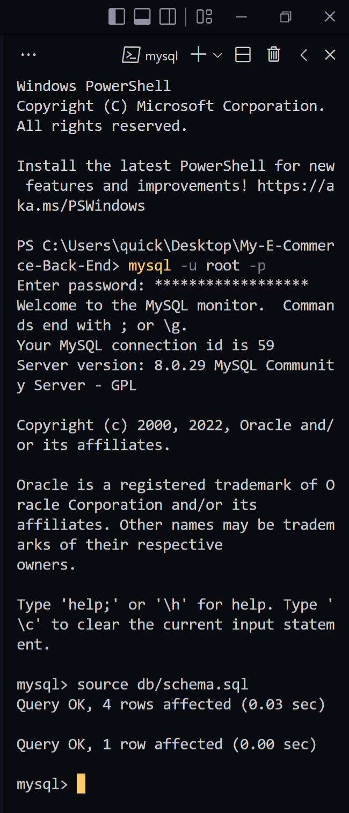
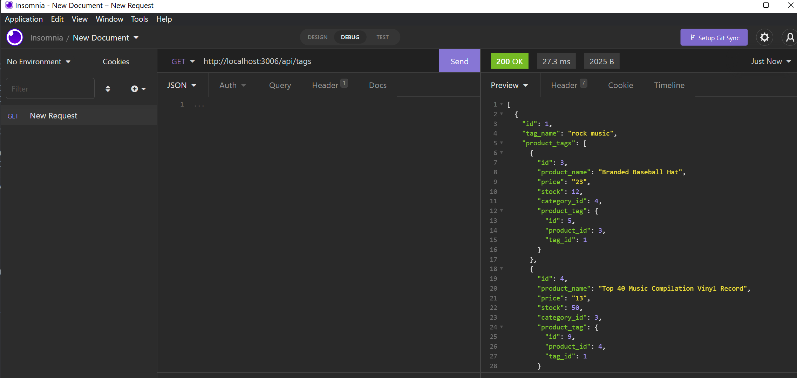

# My-E-Commerce-Back-End

#### [Github repo source](https://github.com/quicksilver524/My-E-Commerce-Back-End)

## Description:

######  This is an *E-Commerce* program built through *Back-End* designed to provide the user an ability to add, update, delete, and view all products within a company. 

## Walkthrough Video:

# Login to your mysql server and type 'source db/schema.sql and quit:

# Open New terminal within VS code or cmdline and type first *npm run seed* and then *npm start* to initiate a seed and start the server:
![Picture 2(./images/ss2png)

# View all products, tags, and categories:

